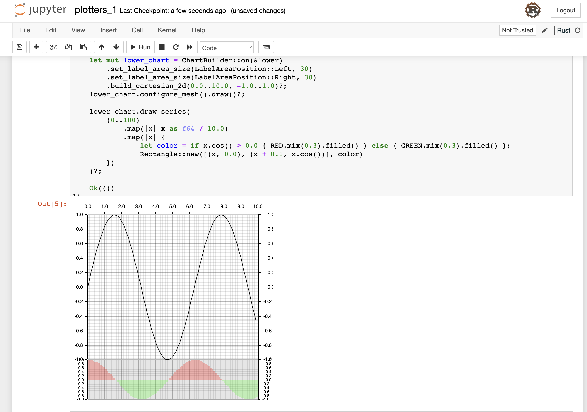

Reference: https://plotters-rs.github.io/plotters-doc-data/evcxr-jupyter-integration.html

## For Ubuntu/Debian users¶

```bash
# Install Jupyter notebook 
sudo apt install libzmq3-dev jupyter-notebook
cargo install evcxr_jupyter
evcxr_jupyter --install
# Get the notebook
jupyter notebook
```

## For OSX users¶
```bash
# Install Jupyter notebook 
brew tap homebrew/core
brew install zeromq pkg-config jupyter
cargo install evcxr_jupyter
evcxr_jupyter --install
# Get the notebook
jupyter notebook
```



To use Plotters with `jupyter-evcxr`, add the below line in the jupyter notebook.
```
:dep plotters = { version = "^0.3.0", default_features = false, features = ["evcxr", "all_series"] }
```