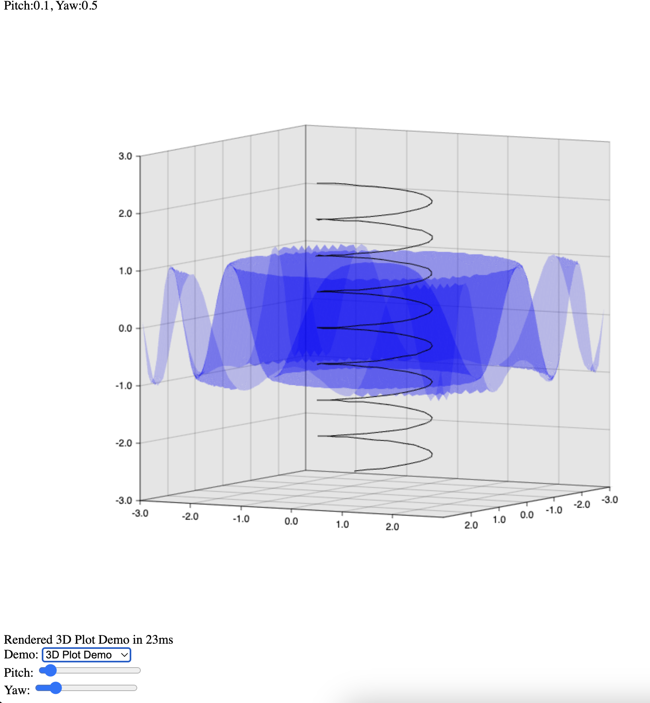

# Purpose
- [x] Draw the Canvas chart by Plotter library
- [x] Javascript call Rust function to raw. Rust is compiled into web-assembly binary code
- [ ] Rhai scripting language call web-assembly function to draw the chart

# Prerequisites
Install [wasm-bindgen](https://rustwasm.github.io/wasm-pack/installer/)

# Build
```
wasm-pack build

cd www
npm run build
npm run start
```

Reference: 
- https://github.com/rhaiscript/playground