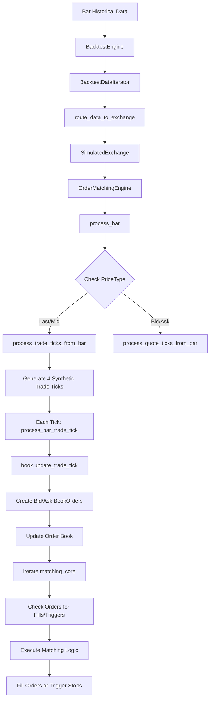

# Bar Data Flow: Order Book Replay

## Complete Data Flow



## 1. Bar Processing Flow

### process_bar Function Entry

```rust
pub fn process_bar(&mut self, bar: &Bar) {
    if !self.config.bar_execution || self.book_type != BookType::L1_MBP {
        return;
    }

    // Skip internally aggregated bars
    if bar_type.aggregation_source() == AggregationSource::Internal {
        return;
    }

    match price_type {
        PriceType::Last | PriceType::Mid => self.process_trade_ticks_from_bar(bar),
        PriceType::Bid => {
            self.last_bar_bid = Some(bar.to_owned());
            self.process_quote_ticks_from_bar();
        }
        PriceType::Ask => {
            self.last_bar_ask = Some(bar.to_owned());
            self.process_quote_ticks_from_bar();
        }
    }
}
```

### Important Limitation for Quote-Based Bars

```rust
fn process_quote_ticks_from_bar(&mut self) {
    if self.last_bar_bid.is_none()
        || self.last_bar_ask.is_none()
        || self.last_bar_bid.unwrap().ts_init != self.last_bar_ask.unwrap().ts_init
    {
        return;  // Early return - requires both bid and ask bars with same timestamp
    }
    // Only processes if both bars exist and have matching timestamps
}
```

## 2. Trade Tick Generation from Bars

### process_trade_ticks_from_bar Function

```rust
fn process_trade_ticks_from_bar(&mut self, bar: &Bar) {
    let sizes = BarTickSizes::from_volume(bar.volume, self.instrument.size_increment());
    
    // Determine market direction
    let aggressor_side = if self.core.last.is_none_or(|last| bar.open > last) {
        AggressorSide::Buyer
    } else {
        AggressorSide::Seller
    };

    // Open: fill at market price (gap from previous bar)
    self.process_bar_trade_tick(bar, bar.open, sizes.open, aggressor_side, "bar open trade tick");
    
    // High: fill at trigger price (market moving up)
    self.process_bar_high(bar, sizes.high);
    
    // Low: fill at trigger price (market moving down)  
    self.process_bar_low(bar, sizes.low);
    
    // Close: fill at trigger price (market continuing)
    self.process_bar_trade_tick(bar, bar.close, sizes.close, aggressor_side, "bar close trade tick");
}
```

### Synthetic Trade Tick Creation

```rust
fn process_bar_trade_tick(
    &mut self,
    bar: &Bar,
    price: Price,
    size: Quantity,
    aggressor_side: AggressorSide,
    context: &str,
) -> bool {
    let trade_tick = TradeTick::new(
        bar.instrument_id(),
        price,
        size,
        aggressor_side,
        self.ids_generator.generate_trade_id(bar.ts_init),
        bar.ts_init,
        bar.ts_init,
    );

    self.update_trade_tick_or_skip(&trade_tick, context);
    self.iterate(trade_tick.ts_init, AggressorSide::NoAggressor);
    true
}
```

## 3. Order Book Update Process

### update_trade_tick Function

```rust
pub fn update_trade_tick(&mut self, trade: &TradeTick) -> Result<(), InvalidBookOperation> {
    let bid = BookOrder::new(
        OrderSide::Buy,
        trade.price,
        trade.size,
        OrderSide::Buy as u64,
    );

    let ask = BookOrder::new(
        OrderSide::Sell,
        trade.price,
        trade.size,
        OrderSide::Sell as u64,
    );

    self.update_book_bid(bid, trade.ts_event);
    self.update_book_ask(ask, trade.ts_event);
    
    Ok(())
}
```

### Order Book State Example

**Bar: Open=100, High=105, Low=95, Close=103, Volume=100**

After each synthetic trade tick:

**Open Tick (Price=100, Size=25):**
```
OrderBook for BTC/USDT (L1_MBP):
- Bids: [(Price=100.0, Size=25)]
- Asks: [(Price=100.0, Size=25)]
- Best Bid: 100.0
- Best Ask: 100.0
```

**High Tick (Price=105, Size=25):**
```
OrderBook for BTC/USDT (L1_MBP):
- Bids: [(Price=105.0, Size=25)]
- Asks: [(Price=105.0, Size=25)]
- Best Bid: 105.0
- Best Ask: 105.0
```

**Low Tick (Price=95, Size=25):**
```
OrderBook for BTC/USDT (L1_MBP):
- Bids: [(Price=95.0, Size=25)]
- Asks: [(Price=95.0, Size=25)]
- Best Bid: 95.0
- Best Ask: 95.0
```

**Close Tick (Price=103, Size=25):**
```
OrderBook for BTC/USDT (L1_MBP):
- Bids: [(Price=103.0, Size=25)]
- Asks: [(Price=103.0, Size=25)]
- Best Bid: 103.0
- Best Ask: 103.0
```

## 4. Order Matching Engine Flow

### iterate Function

```rust
pub fn iterate(&mut self, timestamp_ns: UnixNanos, aggressor_side: AggressorSide) {
    // Update matching core with current market prices
    if let Some(bid) = self.book.best_bid_price() {
        self.core.set_bid_raw(bid);
    }
    if let Some(ask) = self.book.best_ask_price() {
        self.core.set_ask_raw(ask);
    }

    // Check bid orders for fills/triggers
    for action in self.core.iterate_bids() {
        match action {
            MatchAction::FillLimit(id) => self.fill_limit_order(id),
            MatchAction::TriggerStop(id) => self.trigger_stop_order(id),
        }
    }

    // Check ask orders for fills/triggers
    for action in self.core.iterate_asks() {
        match action {
            MatchAction::FillLimit(id) => self.fill_limit_order(id),
            MatchAction::TriggerStop(id) => self.trigger_stop_order(id),
        }
    }
}
```

### Matching Core Logic

```rust
fn match_limit_order(&self, order: &RestingOrder) -> Option<MatchAction> {
    if let Some(limit_price) = order.limit_price
        && self.is_limit_fillable(order.order_side, limit_price)
    {
        Some(MatchAction::FillLimit(order.client_order_id))
    } else {
        None
    }
}

fn match_stop_order(&self, order: &RestingOrder) -> Option<MatchAction> {
    if !order.is_activated {
        return None;
    }

    if let Some(trigger_price) = order.trigger_price
        && self.is_stop_matched(order.order_side, trigger_price)
    {
        Some(MatchAction::TriggerStop(order.client_order_id))
    } else {
        None
    }
}

pub fn is_limit_matched(&self, side: OrderSideSpecified, price: Price) -> bool {
    match side {
        OrderSideSpecified::Buy => self.ask.is_some_and(|a| a <= price),
        OrderSideSpecified::Sell => self.bid.is_some_and(|b| b >= price),
    }
}

pub fn is_stop_matched(&self, side: OrderSideSpecified, price: Price) -> bool {
    match side {
        OrderSideSpecified::Buy => self.ask.is_some_and(|a| a >= price),
        OrderSideSpecified::Sell => self.bid.is_some_and(|b| b <= price),
    }
}
```

## 5. Complete Execution Example

### Scenario Setup

- **Bar:** Open=100, High=105, Low=95, Close=103
- **Pending Orders:**
  - Order 1: BUY LIMIT at 102 (Quantity=10)
  - Order 2: SELL LIMIT at 104 (Quantity=5)
  - Order 3: BUY STOP at 106 (Quantity=8)
  - Order 4: SELL STOP at 94 (Quantity=6)

### Tick 1: Open (Price=100)

```rust
// Order Book State:
core.bid = Some(100.0)
core.ask = Some(100.0)

// Order matching:
- Order 1 (BUY LIMIT 102): ask(100) <= limit(102)? YES → FILL at 100
- Order 2 (SELL LIMIT 104): bid(100) >= limit(104)? NO → No fill
- Order 3 (BUY STOP 106): ask(100) >= trigger(106)? NO → No trigger
- Order 4 (SELL STOP 94): bid(100) <= trigger(94)? NO → No trigger
```

Result: Order 1 FILLED at 100 (price improvement from 102)

### Tick 2: High (Price=105)

```rust
// Order Book State:
core.bid = Some(105.0)
core.ask = Some(105.0)

// Order matching:
- Order 1 (BUY LIMIT 102): Already filled, removed
- Order 2 (SELL LIMIT 104): bid(105) >= limit(104)? YES → FILL at 105
- Order 3 (BUY STOP 106): ask(105) >= trigger(106)? NO → No trigger
- Order 4 (SELL STOP 94): bid(105) <= trigger(94)? NO → No trigger
```

Result: Order 2 FILLED at 105 (price improvement from 104)

### Tick 3: Low (Price=95)

```rust
// Order Book State:
core.bid = Some(95.0)
core.ask = Some(95.0)

// Order matching:
- Order 3 (BUY STOP 106): ask(95) >= trigger(106)? NO → No trigger
- Order 4 (SELL STOP 94): bid(95) <= trigger(94)? NO → No trigger
```

Result: No orders matched

### Tick 4: Close (Price=103)

```rust
// Order Book State:
core.bid = Some(103.0)
core.ask = Some(103.0)

// Order matching:
- Order 3 (BUY STOP 106): ask(103) >= trigger(106)? NO → No trigger
- Order 4 (SELL STOP 94): bid(103) <= trigger(94)? NO → No trigger
```

Result: No orders matched

## 6. Stop Order Triggering Example

### Scenario Setup

- **Bar:** Open=100, High=110, Low=90, Close=105
- **Orders:**
  - BUY STOP at 108 (Quantity=10)
  - SELL STOP at 92 (Quantity=5)

### Execution Flow

**Tick 1: Open (Price=100):**
```rust
core.ask = 100.0
core.bid = 100.0
- BUY STOP 108: ask(100) >= trigger(108)? NO
- SELL STOP 92: bid(100) <= trigger(92)? NO
```

**Tick 2: High (Price=110):**
```rust
core.ask = 110.0
core.bid = 110.0
- BUY STOP 108: ask(110) >= trigger(108)? YES → TRIGGER!
- SELL STOP 92: bid(110) <= trigger(92)? NO
```

**Stop Trigger Execution:**
```rust
fn trigger_stop_order(client_order_id) {
    match order.order_type() {
        OrderType::StopMarket => {
            self.fill_market_order(client_order_id);  // Market buy at current price
        }
        OrderType::StopLimit => {
            self.fill_limit_order(client_order_id);  // Limit buy at order price
        }
    }
}
```

**Tick 3: Low (Price=90):**
```rust
core.ask = 90.0
core.bid = 90.0
- SELL STOP 92: bid(90) <= trigger(92)? YES → TRIGGER!
```

**Tick 4: Close (Price=105):**
```rust
core.ask = 105.0
core.bid = 105.0
- Both stops already triggered and processed
```

Result: Both stops triggered and executed

## 7. Key Technical Insights

Trade Ticks Create Crossed Markets:

- Each synthetic trade tick sets both bid and ask to the same price
- Creates immediate fill opportunities
- Simulates realistic market conditions

Order Matching is Continuous:

- Every synthetic tick triggers a full order matching cycle
- 4 ticks per bar (Open, High, Low, Close) provide comprehensive price path coverage
- Enables catching orders that would trigger at any point during the bar

Price-Time Priority:

- Orders checked in strict price-time priority
- Highest bids and lowest asks processed first
- FIFO ordering within same price level

Different Fill Conditions:

- LIMIT orders fill when market price crosses limit price favorably
- STOP orders trigger when market price crosses trigger price unfavorably
- Realistic simulation of actual exchange behavior

4-Tick Approach Benefits:

- Simulates continuous price movement through the bar
- Catches orders at any price level within the bar
- More realistic than single-point bar execution
- Enables price improvement and stop triggering scenarios