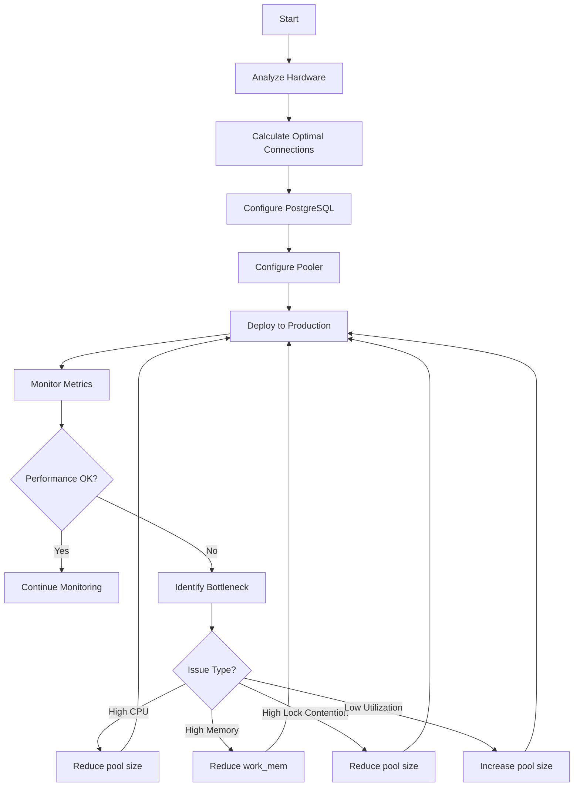

# PostgreSQL Connection Pool - Design and Configuration Guide

## Overview

PostgreSQL connection pooling is essential for managing database resources efficiently and maximizing throughput. This guide covers the configuration parameters and methods for determining optimal connection counts.

## Server-Side Connection Settings

### PostgreSQL Configuration Parameters (postgresql.conf)

- `max_connections` (integer, default: 100)

  Maximum concurrent connections to the database server. Can only be set at server start.

- `reserved_connections` (integer, default: 0)

  Connection slots reserved for roles with `pg_use_reserved_connections` privileges. Can only be set at server start.

- `superuser_reserved_connections` (integer, default: 3)

  Connection slots reserved for superusers (emergency use). Can only be set at server start.

- `listen_addresses` (string, default: localhost)

  IP addresses to listen on (`*` for all, `0.0.0.0` for IPv4 all). Can only be set at server start.

- `port` (integer, default: 5432)

  TCP port for connections. Can only be set at server start.

- `unix_socket_directories` (string, default: /tmp)

  Directories for Unix-domain sockets. Can only be set at server start.

- `unix_socket_group` (string, default: empty)

  Owning group for Unix-domain sockets. Can only be set at server start.

- `unix_socket_permissions` (integer, default: 0777)

  Permissions for Unix-domain sockets. Can only be set at server start.

- `authentication_timeout` (integer, default: 1m)

  Maximum time to complete client authentication. Can be set in postgresql.conf.

- `client_connection_check_interval` (integer, default: 0)

  Time interval (ms) for checking client connectivity during queries. Can be set in postgresql.conf.

### TCP/Network Configuration

- `tcp_keepalives_idle` (integer, default: OS default)

  Seconds of inactivity before sending TCP keepalive.

- `tcp_keepalives_interval` (integer, default: OS default)

  Seconds between unacknowledged keepalive retransmissions.

- `tcp_keepalives_count` (integer, default: OS default)

  Number of lost keepalives before considering connection dead.

- `tcp_user_timeout` (integer, default: OS default)

  Milliseconds data can remain unacknowledged before closing.

## Connection Pooler Configuration (PgBouncer)

### Core Parameters

```ini
[databases]
dbname = host=127.0.0.1 port=5432

[pgbouncer]
pool_mode = transaction           # session | transaction | statement
max_client_conn = 1000           # Maximum client connections
default_pool_size = 25           # Server connections per database
min_pool_size = 0                # Minimum server connections to maintain
reserve_pool_size = 0            # Additional connections during peak
reserve_pool_timeout = 3         # Seconds to wait for reserve connection
server_lifetime = 3600           # Maximum connection lifetime (seconds)
server_idle_timeout = 600        # Close idle server connections after (seconds)
server_connect_timeout = 15      # Connection timeout (seconds)
query_timeout = 0                # Query execution timeout (0 = disabled)
client_idle_timeout = 0          # Close idle client connections after (seconds)
```

### Pool Modes

- `session` mode

  Behavior: One connection per client (no pooling). Use Case: Limited use, testing.

- `transaction` mode

  Behavior: Return connection after each transaction. Use Case: Recommended for most workloads.

- `statement` mode

  Behavior: Return connection after each statement. Use Case: Specific isolation requirements.

## Calculating Optimal Connection Count

### The Fundamental Formula

The PostgreSQL wiki establishes a well-validated formula for optimal throughput:

```
optimal_connections = (core_count × 2) + effective_spindle_count
```

**Component Definitions:**

- `core_count`: Physical CPU cores (exclude hyperthreading threads)
- `effective_spindle_count`: Number of disk drives actively seeking data

  **0** if active dataset is fully cached in RAM. Approaches actual spindle count as cache hit rate decreases. For SSD storage: typically **0** (negligible seek time overhead).

### Calculation Steps

#### Step 1: Determine CPU Capacity

```bash
# macOS
sysctl -n hw.physicalcpu    # Physical cores
sysctl -n hw.logicalcpu     # Logical cores (includes hyperthreading)

# Linux
nproc                      # Logical cores
lscpu | grep "Core(s)"     # Physical cores
```

#### Step 2: Analyze Workload Type

- OLTP (transactional)

  Characteristics: Many short queries, high concurrency. Connection Strategy: Higher pool count (formula-based).

- OLAP (analytics)

  Characteristics: Long-running queries, low concurrency. Connection Strategy: Lower pool count (formula-based ÷ 2).

- Mixed

  Characteristics: Variable patterns. Connection Strategy: Start with formula, monitor and adjust.

#### Step 3: Calculate Working Memory

Ensure sufficient memory per connection:

```
work_mem × max_active_connections × operations_per_query ≤ Available RAM
```

**Example Calculation:**
- Hardware: 8 cores, 16GB RAM, SSD
- Available RAM for queries: 12GB (4GB for OS + shared_buffers)
- Target connections: (8 × 2) + 0 = 16
- Estimated operations: 2 (sort/hash per query)
- Maximum work_mem: 12GB / (16 × 2) = 384MB per connection

#### Step 4: Apply Buffers

```
max_connections = optimal_connections × 2 + 10
default_pool_size = optimal_connections + 4
```

### Example Configurations

#### Example 1: Small Application Server

**Hardware:** 4 cores, 8GB RAM, SSD storage

```ini
# postgresql.conf
max_connections = 100
shared_buffers = 2GB
work_mem = 32MB
effective_cache_size = 6GB

# pgbouncer.ini
max_client_conn = 200
default_pool_size = 12           # (4 × 2) + 0 + 4
pool_mode = transaction
```

#### Example 2: Medium Production Server

**Hardware:** 8 cores, 32GB RAM, SSD storage

```ini
# postgresql.conf
max_connections = 200
shared_buffers = 8GB             # 25% of RAM
work_mem = 64MB
effective_cache_size = 24GB       # 75% of RAM
maintenance_work_mem = 1GB

# pgbouncer.ini
max_client_conn = 1000
default_pool_size = 20            # (8 × 2) + 0 + 4
pool_mode = transaction
reserve_pool_size = 5
reserve_pool_timeout = 3
```

#### Example 3: Large Analytics Server

**Hardware:** 16 cores, 128GB RAM, HDD storage with 10 spindles

```ini
# postgresql.conf
max_connections = 500
shared_buffers = 32GB
work_mem = 256MB
effective_cache_size = 96GB
maintenance_work_mem = 2GB

# pgbouncer.ini
max_client_conn = 2000
default_pool_size = 42            # (16 × 2) + 10 + 4
pool_mode = transaction
reserve_pool_size = 10
reserve_pool_timeout = 5
```

## Performance Principles

### Why More Connections ≠ Better Performance

PostgreSQL performance typically shows a "knee" in throughput vs connections:

1. **Initial Phase:** Throughput increases with more connections as resources are utilized
2. **Saturation:** All resources (CPU, memory, I/O) are fully utilized
3. **Degradation:** Throughput declines beyond saturation due to resource contention

**Causes of Performance Degradation:**

- **Lock Contention:** Increased CPU time spent on spinlocks, LW locks, and heavyweight locks
- **Context Switching:** Processor overhead switching between processes
- **Cache Line Contention:** Frequent cache invalidation and reloading
- **Memory Pressure:** Excessive `work_mem` allocation causes cache eviction or swapping
- **Disk Contention:** Random I/O patterns cause thrashing on spinning disks

### Queue vs Oversubscribe

Contrary to intuition, queuing transactions often results in **faster completion** than oversubscribing connections:

```
10,000 transactions:
  - 5-20 at a time: Faster overall completion
  - 500 at a time: Slower due to contention overhead
```

**Practical Implication:**
- Configure pool to match optimal connection count
- Let the pooler queue excess requests
- Execute transactions when resources become available

## Connection Pool Placement

### Placement Options

```
Application Server
    ↓
┌─────────────────────────────┐
│ Connection Pool Location    │
├───────────────┬─────────────┤
│ Client-side   │ Server-side │
│ (in-app)      │ (separate)  │
└───────────────┴─────────────┘
          ↓                 ↓
    PostgreSQL       PostgreSQL
```

### Comparison

Client-Side Pool:
- Latency: Lower (no network hop)
- Setup: Simpler
- Management: Per-application
- Resource Usage: Distributed
- Connection Storms: Possible
- Recommended: Small-scale applications

Server-Side Pool:
- Latency: Slightly higher
- Setup: Requires additional infrastructure
- Management: Centralized
- Resource Usage: Concentrated
- Connection Storms: Mitigated by centralized queuing
- Recommended: Production environments

## Monitoring and Tuning

### Connection Monitoring Queries

```sql
-- Current connections by database
SELECT 
    datname,
    state,
    count(*) AS connection_count
FROM pg_stat_activity
GROUP BY datname, state
ORDER BY datname, state;

-- Active vs idle connections
SELECT 
    CASE 
        WHEN state = 'active' THEN 'Active'
        WHEN state = 'idle' THEN 'Idle'
        WHEN state = 'idle in transaction' THEN 'Idle in Transaction'
        ELSE state
    END AS connection_state,
    count(*) AS count
FROM pg_stat_activity
WHERE datname = current_database()
GROUP BY connection_state;

-- Long-running queries
SELECT 
    pid,
    now() - query_start AS duration,
    query,
    state
FROM pg_stat_activity
WHERE state = 'active'
  AND now() - query_start > interval '5 minutes'
ORDER BY duration DESC;

-- Connection utilization
SELECT 
    max_connections::int,
    (SELECT count(*) FROM pg_stat_activity WHERE state = 'active') AS active,
    (SELECT count(*) FROM pg_stat_activity WHERE state = 'idle') AS idle,
    (SELECT count(*) FROM pg_stat_activity) AS total,
    ROUND(
        (SELECT count(*)::float FROM pg_stat_activity) / max_connections::int * 100, 
        2
    ) AS utilization_percent
FROM (
    SELECT setting AS max_connections 
    FROM pg_settings 
    WHERE name = 'max_connections'
) settings;
```

### PgBouncer Monitoring

```bash
# Show pool statistics
psql -h localhost -p 6432 -U pgbouncer -c "SHOW STATS;"

# Show active pools
psql -h localhost -p 6432 -U pgbouncer -c "SHOW POOLS;"

# Show server lists
psql -h localhost -p 6432 -U pgbouncer -c "SHOW SERVERS;"

# Show client connections
psql -h localhost -p 6432 -U pgbouncer -c "SHOW CLIENTS;"

# Real-time monitoring (watch mode)
watch -n 1 'psql -h localhost -p 6432 -U pgbouncer -c "SHOW POOLS;"'
```

### Key Metrics to Monitor

- Connection Utilization

  Description: % of `max_connections` in use. Target Range: 60-80% during peak.

- Pool Wait Time

  Description: Time clients wait for connections. Target Range: < 100ms (P99).

- Query Duration

  Description: Average query execution time. Target Range: Depends on workload.

- Lock Contention

  Description: % time spent waiting on locks. Target Range: < 5%.

- Cache Hit Ratio

  Description: % queries served from cache. Target Range: > 99% for OLTP.

- Context Switches

  Description: OS context switches per second. Target Range: Monitor trends.

## Common Pitfalls and Solutions

### Pitfall 1: Oversubscribing Connections

**Problem:** Setting `max_connections` or pool size too high causes resource contention and performance degradation.

**Solution:**
- Use the formula as a starting point
- Monitor performance metrics
- Reduce connections if contention increases

### Pitfall 2: Ignoring Reserved Connections

**Problem:** Setting `max_connections` equal to pool size leaves no room for maintenance or emergencies.

**Solution:**
```
max_connections = pool_size × 2 + 10
```

### Pitfall 3: Choosing Wrong Pool Mode

**Problem:** Using `session` mode negates pooling benefits; `statement` mode breaks transaction semantics.

**Solution:**
- Use `transaction` mode for most workloads
- Use `session` only when you need persistent state
- Avoid `statement` mode unless required

### Pitfall 4: Not Monitoring

**Problem:** Without metrics, you cannot detect configuration issues or performance regressions.

**Solution:**
- Implement monitoring for all key metrics
- Set up alerts for high utilization or wait times
- Regularly review and adjust configuration

### Pitfall 5: Confusing Connections with Throughput

**Problem:** Assuming more connections automatically means higher throughput.

**Solution:**
- Focus on optimizing queries and indexes first
- Use connection pooling to manage contention
- Remember: fewer optimized connections > many contended connections

## Tuning Workflow



## Additional Resources

### Official Documentation

- [PostgreSQL Connection Settings](https://www.postgresql.org/docs/16/runtime-config-connection.html)
- [PostgreSQL Wiki: Number Of Database Connections](https://wiki.postgresql.org/wiki/Number_Of_Database_Connections)
- [PgBouncer Documentation](https://www.pgbouncer.org/usage.html)

### Tools

- **pg_stat_statements:** Query performance statistics
- **pgBadger:** PostgreSQL log analyzer
- **pgbench:** PostgreSQL benchmarking tool
- **PMM:** Percona Monitoring and Management

### Best Practice Summary

1. Start with the formula: `(core_count × 2) + effective_spindle_count`
2. Add buffer: `pool_size = optimal + 4`, `max_connections = pool_size × 2 + 10`
3. Use `transaction` pool mode for most workloads
4. Monitor key metrics continuously
5. Adjust based on actual performance data
6. Always leave headroom for maintenance and emergencies
7. Remember: Optimal connections are actively working, not idle ones