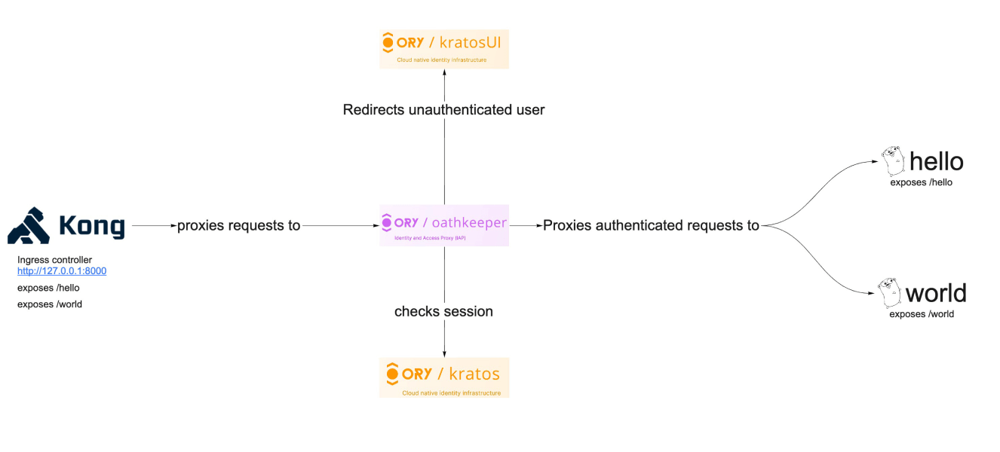
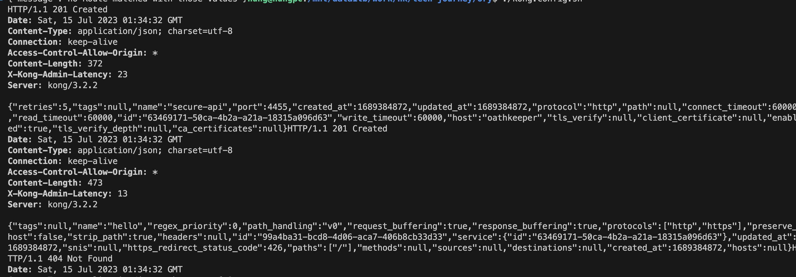
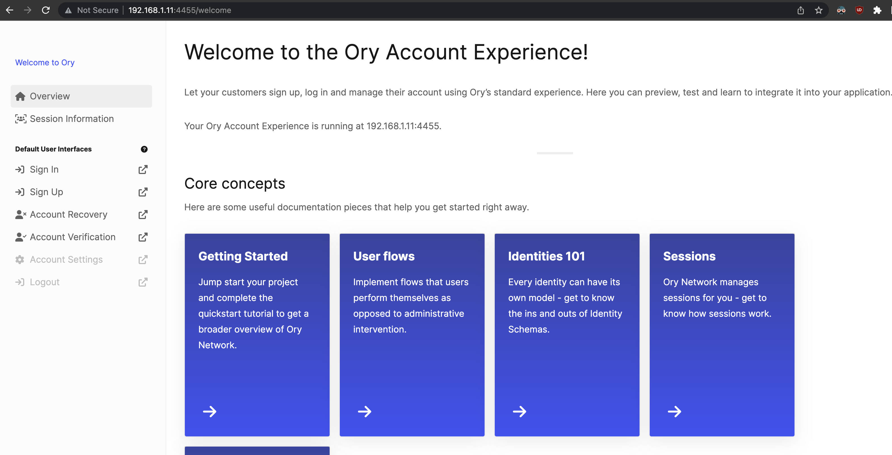

# API Gateway using Kong, Ory Kratos & Ory Oathkeeper

Reference: https://www.ory.sh/zero-trust-api-security-ory-tutorial/



# Overview

- Kong gateway can be an excellent solution for an ingress load balancer and API gateway if you do not want vendor lock-in of any cloud API Gateways in your application. Kong uses OpenResty and Lua. OpenResty extends Nginx with Lua scripting to use Nginx's event model for non-blocking I/O with HTTP clients and remote backends like PostgreSQL, Memcached, and Redis. OpenResty is not an Nginx fork, and Kong is not an Openresty fork. Kong uses OpenResty to enable API gateway features.

- Oathkeeper acts like an identity and access proxy for our microservices. It allows us to proxy only authenticated requests to our microservices, so we don't need to implement middleware to check authentication. It can also transform requests, for example, convert session auth into JWT for a back-end service.

- Kratos is the authentication provider; it handles all first-party authentication flows: username/password, forgot password, MFA/2FA, and more. It also provides OIDC/social login capabilities for example, "Login with GitHub".

- A simple Go HTTP API that exposes /greet endpoint and listens :8090 port.

Request Flow:

```
User -> Kong -> Ory Oathkeeper -> Ory Kratos -> Go API
```

Ory Oathkeeper checks the incoming request for presence of ory_kratos_session and does the following steps:

Proxies request to Go HTTP API if the identity check passes in Ory Kratos.
Redirects user to the Kratos UI if the identity check fails.

# Flow

- **User** create the database, then modify the value of `KRATOS_DSN` in the `.env` file.
- `docker/kong-migrations` run the Kong-related migrations.
- `docker/kratos-migrate` run the Kratos-related migrations.
- Boot up `docker/hello` and `docker/world` microservices
- Kong container that exposes 8000 port for proxying traffic and 8001 port with admin API.
- **User** run `./kong.config.sh` to create a service for Kong and configure routes.
    
- **User** open `http://127.0.0.1:8000/hello` or `http://127.0.0.1:8000/world` in your browser and there are two possible scenarios:
    - You receive {"message": "Hello microservice"} (or "World microservice").
    - The browser redirects you to http://127.0.0.1:4455/login.

- You can get an activation link "localhost:4436" for Mailslurper - a mock Email server.


# Prequisites
- Create Postgres database:
    - Database Name: kong1
    - Database User: kong1

```sql
create database kong1;
create user kong1 with password 'kong1';
grant all privileges on database kong1 to kong1;

create database kratos1;
create user kratos1 with password 'kratos1';
grant all privileges on database kratos1 to kratos1;

```

# Run locally

Using docker-compose

```
docker-compose up --build
```
Open http://127.0.0.1:8000/hello in your browser and follow the login flow

The docker-compose command builds a go webserver, runs all services, and exposes the following ports:

- HTTP :8001 and SSL :8444 ports for Kong Gateway admin API
- HTTP :8000 and SSL :8444 ports for Kong Gateway Proxy listener
- HTTP :4433 and :4434 are public and admin APIs of Ory Kratos
- HTTP :4436 for Mailslurper
- HTTP :4455 for starting sign-up/login/recovery flows.

# Configuring Kong
That command creates an /greet endpoint on secure-api service and creates a reverse proxy for Ory Oathkeeper.

```sh
bash config.kong.sh
```

# Configuring Ory Oathkeeper

Oathkeeper checks sessions and proxies traffic to our microservice while Kong provides ingress load balancing. 

Oauthkeeper need two config files:
- Access rules are in [yml file](oathkeeper/access-rules.yml)
- [Configuration](oauthkeeper/oathkeeper.yml)

Ory Oathkeeper now looks up a valid session in the request cookies, and proxies only authenticated requests. It redirects to login UI if there's no `ory_kratos_session` cookie available. (defined in the `oauthkeeper.yml` file)

# Configuring Kratos

One config [file](kratos/kratos.yml)

## Write Identity schema
Reference: https://www.ory.sh/docs/kratos/manage-identities/customize-identity-schema#writing-your-first-custom-identity-schema

The created identity schema is in the [file](kratos/identity.schema.json)

## Kratos Self Service
Reference: https://www.ory.sh/docs/kratos/self-service

Three flow types:
- Browser flows for server-side apps
- Browser flows for client-side apps
- API flows

### Browser flows for server-side apps
The browser flow has three stages:
- Initialize and redirect to UI
- Form rendering
- Form submission and payload validation

### Browser flows for client-side apps
- Initialization without redirect using an AJAX request
- Client-side apps render form using HTML
- Client-side apps submit the form as application/json and payload validation

### API flows
- Initialization without redirect and cookies;
- Form rendering using for example native iOS, Android, ... components;
- Form submission as application/json and payload validation.